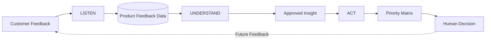
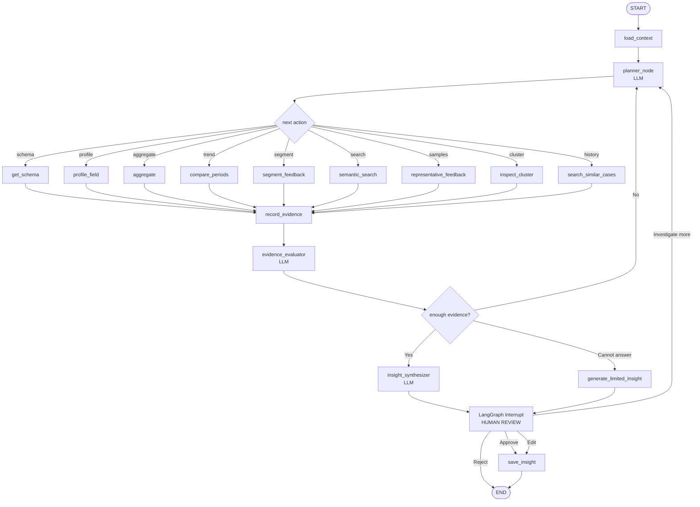
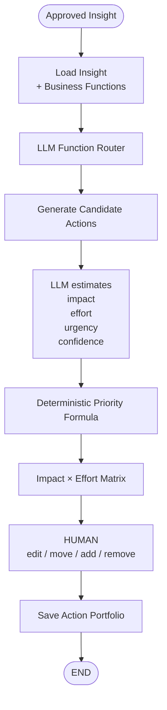
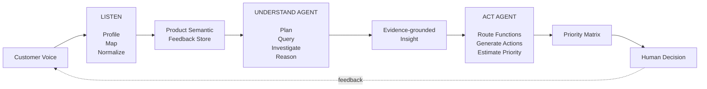

# VoC Agent Operating System — Technical Implementation Plan

## 0. Project Goal

Build a **product-scoped Voice of Customer operating system** based on:

**LISTEN → UNDERSTAND → ACT**

The system should help teams turn heterogeneous customer feedback into:

```text
Raw Feedback
→ Structured Product Data
→ Evidence
→ Insight
→ Recommended Actions
→ Human Prioritization
```

The system is explicitly **Human-in-the-Loop**.

Core principle:

> AI proposes and investigates.\
> Deterministic systems calculate and enforce constraints.\
> Humans govern meaning and business decisions.

---

# 1. Product Scope

The system operates at the **single-product level**./

```text
Workspace
│
├── Product A
│   ├── Sources
│   ├── Product Schema
│   ├── Taxonomy
│   ├── Feedback
│   ├── Insights
│   └── Actions
│
└── Product B
    ├── Sources
    ├── Product Schema
    ├── Taxonomy
    ├── Feedback
    ├── Insights
    └── Actions
```

Each product may have completely different analytical dimensions.

Example:

```text
AI SaaS Product

app_version
plan
product_area
device
journey_stage
```

versus:

```text
Coffee Machine

machine_model
component
warranty
purchase_channel
manufacturing_batch
```

The system must therefore support:

> Dynamic product schema + stable system architecture.

---

# 2. High-Level Architecture



Three major AI capabilities:

```text
LISTEN
AI Schema Mapping

UNDERSTAND
Agentic Investigation

ACT
Action Recommendation
```

Only **UNDERSTAND** requires a strong autonomous LangGraph reasoning loop.

---

# 3. Core Technical Principle

The system has four semantic layers.

```text
1. SOURCE TRUTH
   Raw imported information

2. NORMALIZED STRUCTURE
   Common product-feedback representation

3. SEMANTIC INTERPRETATION
   Topics, themes, sentiment, severity

4. ANALYTICAL INSIGHT
   Patterns, hypotheses and recommendations
```

Never mix them.

Example:

```text
Source Truth

"NPS_SCORE": "3"

        ↓

Normalized

metric = NPS
value = 3
scale = 0–10

        ↓

Semantic

topic = Authentication
sentiment = Negative

        ↓

Insight

Authentication complaints increased 42%
after release v2.17.
```

---

# 4. LISTEN

## 4.1 Goal

Convert heterogeneous incoming feedback into a product-level analytical structure without forcing every source into a giant rigid database schema.

LISTEN answers:

> What does this incoming data mean?

---

# 5. Supported Input Types

MVP:

```text
CSV / Excel
Generic REST API
Manual feedback entry
```

Future:

```text
Zendesk
Intercom
Qualtrics
Gmail
App Store
Google Play
Reddit
Social Media
CRM
```

All connectors eventually produce the same ingestion interface.

```python
class FeedbackConnector:

    def fetch():
        ...

    def profile():
        ...

    def normalize():
        ...
```

---

# 6. Import Workflow

## First Import

Example CSV:

```text
ticket_id
created_at
message
plan
feature
version
country
browser
agent_name
status
```

Process:

```text
CSV
↓
Deterministic profiling
↓
LLM semantic mapping
↓
Human review
↓
Validation
↓
Product schema update
↓
Import
```

---

# 7. Column Profiler

The profiler is deterministic.

Do NOT use an LLM for basic profiling.

For every column calculate:

```text
column_name
detected_type
missing_rate
unique_count
cardinality
sample_values
min
max
average length
```

Example:

```json
{
  "name": "version",
  "detected_type": "categorical",
  "coverage": 0.97,
  "cardinality": 14,
  "samples": [
    "2.17",
    "2.16",
    "2.18"
  ]
}
```

Only the profile is sent to the LLM.

Do not send the entire CSV unless strictly necessary.

---

# 8. Product Schema Registry

The Product Schema Registry defines what dimensions the product currently understands.

Example:

```json
{
  "product_id": "product_a",
  "version": 3,

  "fields": [
    {
      "key": "app_version",
      "label": "Application Version",
      "description": "Software version active when feedback occurred",
      "type": "category"
    },

    {
      "key": "customer_plan",
      "label": "Customer Plan",
      "type": "category"
    },

    {
      "key": "product_area",
      "label": "Product Area",
      "type": "category"
    }
  ]
}
```

The registry is:

```text
dynamic
versioned
product-specific
human-governed
```

---

# 9. System Core Fields

Do not let the first CSV define everything.

Every product begins with a tiny stable system kernel.

```text
feedback_text
occurred_at
source
source_record_id
```

Logical Product Schema:

```text
System Core
+
Product Fields
```

---

# 10. Incoming Field Decisions

Every incoming field must result in one of:

```text
MAP
PROMOTE
SOURCE_META
IGNORE
AMBIGUOUS
```

## MAP

Map to an existing product field.

```text
build
→ app_version
```

## PROMOTE

Create a candidate new product-level field.

```text
device_os
→ candidate Product field
```

## SOURCE\_META

Useful only within its original source.

```text
zendesk_agent
ticket_status
survey_response_id
```

## IGNORE

No useful analytical value.

```text
csv_row_number
debug_identifier
```

## AMBIGUOUS

Semantic meaning unclear.

```text
score = 5
```

Possible meanings:

```text
CSAT 1–5
NPS 0–10
Star rating 1–5
Custom rating
```

Requires human review.

---

# 11. Schema Mapping LLM

Input:

```json
{
  "existing_schema": [...],
  "incoming_profiles": [...]
}
```

Output:

```json
{
  "source_field": "build",

  "decision": "MAP",

  "target": "app_version",

  "confidence": 0.97,

  "reason": "Values and semantics match application version.",

  "needs_human_review": false
}
```

The LLM is allowed to:

```text
suggest
map
explain
propose
```

The LLM is NOT allowed to:

```text
silently alter Product Schema
delete schema fields
rewrite historical meaning
import directly into production
```

---

# 12. LISTEN HITL

Human reviews AI mapping.

Human can:

```text
Approve
Remap
Rename
Promote
Demote to source metadata
Ignore
```

This is HITL Gate #1.

Purpose:

> Human governs data meaning.

---

# 13. Subsequent Imports

Suppose current schema has:

```text
feedback_text
occurred_at
customer_plan
product_area
app_version
country
language
```

New CSV:

```text
response
date
subscription
build
region
```

AI should first attempt:

```text
response → feedback_text
date → occurred_at
subscription → customer_plan
build → app_version
region → country
```

Only genuinely new concepts should propose schema expansion.

---

# 14. Promotion Rule

Do NOT promote every unmatched field.

Ask:

> Would this field still make analytical sense if the feedback came from another source for the same product?

If yes:

```text
candidate Product field
```

If no:

```text
source metadata
```

Example:

```text
app_version
→ Product field

zendesk_ticket_status
→ Source metadata
```

---

# 15. Physical Database Strategy

Do not create SQL columns every time the Product Schema changes.

Physical PostgreSQL schema remains stable.

Example:

```sql
feedback

id
workspace_id
product_id
import_id
source
source_record_id
occurred_at
feedback_text
data JSONB
source_meta JSONB
ai_analysis JSONB
created_at
```

---

# 16. Example Feedback Record

```json
{
  "id": "fb_981",

  "product_id": "product_a",

  "source": "zendesk",

  "occurred_at": "2026-08-20",

  "feedback_text": "Search citations are fake.",

  "data": {
    "app_version": "2.17",
    "customer_plan": "enterprise",
    "product_area": "search"
  },

  "source_meta": {
    "ticket_status": "open",
    "agent": "Anna"
  },

  "ai_analysis": {
    "topics": ["CITATION"],
    "sentiment": "negative",
    "severity": "high"
  }
}
```

---

# 17. Meaning of JSONB Zones

## `data`

Product-level analytical dimensions.

```text
app_version
customer_plan
product_area
device
country
journey_stage
```

## `source_meta`

Source-specific information.

```text
ticket_status
survey_id
agent
response_progress
```

## `ai_analysis`

Derived semantic interpretation.

```text
topics
themes
sentiment
severity
problem_type
analysis_version
```

---

# 18. Raw Data Storage

Original imports should be kept outside PostgreSQL.

Use:

```text
Supabase Storage
S3
Cloudflare R2
```

Store:

```text
original CSV
original connector payload
historical export
```

Database stores:

```text
import_id
storage_path
source_type
mapping_version
schema_version
```

This preserves source truth without bloating the operational database.

---

# 19. Dynamic Field Coverage

Because different sources contain different fields, track coverage.

Example:

```text
app_version       72%
customer_plan     91%
country           94%
device_os         31%
```

Coverage means:

```text
records_with_field
/
relevant_records
```

The Agent must use coverage when judging evidence quality.

---

# 20. Taxonomy

Product Schema and Taxonomy are different.

Product Schema:

> What analytical dimensions exist?

Taxonomy:

> What is the customer talking about?

Example taxonomy:

```text
AI Quality
├── Hallucination
├── Citation
└── Instruction Following

Search
├── Relevance
├── Latency
└── No Results

Account
├── Authentication
└── Permission
```

---

# 21. Taxonomy Governance

Use:

```text
Canonical Taxonomy
+
Dynamic Emerging Themes
```

AI cannot automatically mutate canonical taxonomy.

Flow:

```text
Feedback
↓
Existing taxonomy match?
↓
Yes → classify

No
↓
Emerging theme
↓
Accumulate evidence
↓
Human taxonomy review
↓
Approve / Merge / Reject
```

---

# 22. Semantic Preprocessing

Run asynchronously after feedback import.

Processing:

```text
Topic classification
Sentiment
Severity
Problem type
Embedding
Clustering
Emerging theme detection
```

Not everything needs an LLM.

Possible implementations:

```text
Embeddings
Deterministic calculations
LLM structured classification
Clustering algorithms
```

---

# 23. UNDERSTAND

## Goal

Turn feedback data into an evidence-grounded, decision-ready insight.

UNDERSTAND answers:

> What is happening?

> Who is affected?

> How significant is it?

> What changed?

> Why might it be happening?

> What evidence supports that interpretation?

---

# 24. UNDERSTAND Is The Main LangGraph Agent

Unlike LISTEN, UNDERSTAND should operate as a reasoning loop.

```text
Question / Signal
↓
Load Context
↓
Plan Investigation
↓
Call Tool
↓
Inspect Evidence
↓
Update Hypothesis
↓
Need More Evidence?
↙           ↘
Yes          No
↓             ↓
Tool          Insight
```

---

# 25. Understand State

```python
class UnderstandState(TypedDict):

    product_id: str

    question: str

    trigger_type: str

    product_context: dict

    schema: dict

    taxonomy: dict

    available_dimensions: list

    investigation_plan: list

    hypotheses: list

    evidence: list

    contradictions: list

    coverage_warnings: list

    tool_history: list

    iteration: int

    finding_confidence: float

    hypothesis_confidence: float

    draft_insight: dict | None

    human_review: dict | None
```

---

# 26. Investigation Triggers

Agent investigation starts from either:

## User Question

```text
Why are Search complaints increasing?

What is the biggest problem this month?

Why did CSAT drop?

Are enterprise customers experiencing more login issues?
```

## System Signal

```text
Topic spike
Severity spike
New cluster
Emerging theme
Unexpected sentiment shift
```

---

# 27. Load Product Context

Before reasoning, Agent loads:

```text
Product description
Product Schema
Field Coverage
Taxonomy
Available metrics
Existing clusters
Historical insights
```

Example:

```text
Product:
AI SaaS

Available dimensions:

app_version        72%
customer_plan      91%
product_area       89%
country            94%
device_os          31%

Taxonomy:

Search
├ Citation
├ Relevance
└ Latency
```

---

# 28. Investigation Planner

Planner determines:

```text
What do I already know?

What evidence is missing?

Which dimensions are available?

Which tool should be called next?
```

Example output:

```json
{
  "goal": "Explain Search complaint growth",

  "next_steps": [
    {
      "objective": "Confirm trend",
      "tool": "compare_periods"
    },
    {
      "objective": "Identify growing themes",
      "tool": "aggregate_feedback"
    },
    {
      "objective": "Check app-version concentration",
      "tool": "segment_feedback"
    },
    {
      "objective": "Inspect representative verbatims",
      "tool": "representative_feedback"
    }
  ]
}
```

The plan may change after every result.

---

# 29. Analytics Engine

The LLM never receives the whole JSONB dataset.

Architecture:

```text
LLM
↓
Semantic Tool Request
↓
Validated Analytics Service
↓
Safe Query Compiler
↓
PostgreSQL / Vector Search
↓
Compact Evidence
↓
LLM
```

---

# 30. Understand Agent Tools

MVP tools:

```text
get_schema()

profile_field()

aggregate_feedback()

compare_periods()

segment_feedback()

semantic_search()

representative_feedback()

inspect_cluster()

search_similar_cases()
```

---

# 31. `get_schema`

Input:

```python
get_schema(product_id)
```

Output:

```json
{
  "dimensions": [
    {
      "field": "app_version",
      "type": "category",
      "coverage": 0.72
    }
  ]
}
```

---

# 32. `profile_field`

Input:

```python
profile_field(
    product_id="product_a",
    field="app_version"
)
```

Output:

```json
{
  "coverage": 0.72,

  "distinct": 17,

  "top_values": [
    ["2.17", 4812],
    ["2.16", 3160]
  ]
}
```

---

# 33. `aggregate_feedback`

Input:

```json
{
  "filters": {
    "topic": "SEARCH"
  },

  "group_by": "app_version",

  "metric": "count"
}
```

Backend resolves:

```text
app_version
```

to:

```sql
data->>'app_version'
```

LLM never needs to know this implementation detail.

---

# 34. `compare_periods`

Example:

```json
{
  "filters": {
    "topic": "SEARCH"
  },

  "current": "last_7_days",

  "previous": "previous_7_days"
}
```

Output:

```json
{
  "previous": 207,
  "current": 627,
  "change_pct": 202.9
}
```

---

# 35. `segment_feedback`

Input:

```json
{
  "issue": "fake_citation",

  "dimensions": [
    "app_version",
    "customer_plan",
    "country"
  ]
}
```

Output:

```json
{
  "app_version": {
    "coverage": 0.72,
    "top": "2.17",
    "share": 0.88
  },

  "customer_plan": {
    "coverage": 0.91,
    "top": "enterprise",
    "share": 0.54
  }
}
```

---

# 36. `semantic_search`

Used when the Agent needs qualitative meaning.

Example:

```text
semantic_search(
    query="fabricated citations after update",
    filters={
        app_version: 2.17
    }
)
```

Return only relevant records.

Never bulk-send tens of thousands of verbatims.

---

# 37. Representative Feedback

Representative samples should prefer:

```text
High semantic relevance
Different users
Different sources
Different language patterns
Minimal duplication
```

Example response:

```json
[
  {
    "feedback_id": "fb_812",
    "text": "The citations don't exist."
  },

  {
    "feedback_id": "fb_912",
    "text": "Search gives believable sources but the URLs are fake."
  }
]
```

---

# 38. Evidence Store

Every tool response gets recorded as evidence.

Example:

```json
{
  "evidence_id": "EV_14",

  "type": "aggregate",

  "statement": "88% of version-known fake citation reports are associated with v2.17.",

  "coverage": 0.72,

  "source_tool": "segment_feedback"
}
```

Insights must reference evidence IDs.

---

# 39. Evidence Evaluation

After each tool call, the LLM evaluates:

```text
Does this support an existing hypothesis?

Does it contradict a hypothesis?

Does it reveal a new pattern?

Does it reveal a data-quality problem?

What should be investigated next?
```

Structured output:

```json
{
  "supports": [
    {
      "hypothesis": "Regression associated with v2.17",
      "strength": "strong",
      "evidence_ids": ["EV_12", "EV_14"]
    }
  ],

  "contradictions": [],

  "new_questions": [
    "Is the increase driven specifically by fabricated citations?"
  ],

  "next_action": "inspect_cluster"
}
```

---

# 40. Investigation Limits

Avoid infinite loops.

Suggested:

```text
MAX_ITERATIONS = 8

MAX_RAW_FEEDBACK_PER_TOOL = 30

MAX_TOTAL_VERBATIMS = 80
```

Stop when:

```text
Evidence sufficient

OR

No useful tools remain

OR

Confidence stops improving

OR

Maximum iteration reached
```

---

# 41. Finding vs Hypothesis

Keep these separate.

Finding:

> Search complaints increased 203%.

Evidence-backed fact.

Hypothesis:

> v2.17 may contain a citation-validation regression.

Inference.

Store separate confidence:

```text
finding_confidence = 0.91

hypothesis_confidence = 0.67
```

Never present a hypothesis as confirmed root cause.

---

# 42. Insight Model

```json
{
  "title": "Fabricated citation complaints concentrated in v2.17",

  "finding": "Search complaints increased 203% week over week and the largest increase came from fabricated citation reports.",

  "affected_context": {
    "app_version": "2.17",
    "customer_plan": "enterprise"
  },

  "impact": [
    "trust_loss",
    "core_task_quality"
  ],

  "evidence": [
    "EV_12",
    "EV_14",
    "EV_18"
  ],

  "hypothesis": {
    "statement": "A citation-validation regression may have been introduced in v2.17.",
    "confidence": 0.67
  },

  "finding_confidence": 0.91,

  "limitations": [
    "App-version coverage is 72%.",
    "Feedback evidence cannot prove technical causality."
  ]
}
```

---

# 43. UNDERSTAND HITL

Human sees:

```text
Finding

Evidence

Affected context

Hypothesis

Confidence

Data limitations
```

Actions:

```text
Approve

Edit

Investigate More

Reject
```

This is HITL Gate #2.

Purpose:

> Human validates meaning.

---

# 44. ACT

## Goal

Convert an approved insight into plausible business actions.

ACT does NOT execute business changes.

ACT answers:

> What could the organization reasonably do about this issue?

---

# 45. Business Functions

Fixed action-function taxonomy:

```text
MARKETING

LEGAL

DESIGN

FINANCE

ENGINEERING

OPERATION

SALES

SUPPORT
```

The Agent should not force an action for every function.

Functions can be:

```text
Relevant

Potentially Relevant

Not Relevant
```

---

# 46. ACT Input

ACT consumes the approved insight.

Example:

```json
{
  "issue": "Fabricated citations increased after v2.17",

  "severity": "high",

  "impact": [
    "trust_loss"
  ],

  "affected_context": {
    "customer_plan": "enterprise"
  },

  "hypothesis": {
    "statement": "Possible citation validation regression",
    "confidence": 0.67
  },

  "evidence": [
    "EV_12",
    "EV_14"
  ]
}
```

ACT does not re-read 50k feedback rows.

---

# 47. Functional Routing

ACT LLM estimates relevance.

Example:

```json
{
  "functions": [
    {
      "function": "ENGINEERING",
      "relevance": 0.96
    },

    {
      "function": "SUPPORT",
      "relevance": 0.88
    },

    {
      "function": "DESIGN",
      "relevance": 0.67
    },

    {
      "function": "FINANCE",
      "relevance": 0.12
    }
  ]
}
```

Possible rule:

```text
relevance >= 0.5
→ generate candidate action
```

---

# 48. Action Generation

Example Engineering action:

```json
{
  "function": "ENGINEERING",

  "action": "Investigate citation-validation changes introduced in v2.17.",

  "rationale": "The issue is strongly concentrated in v2.17.",

  "impact": 9,

  "effort": 4,

  "urgency": 9,

  "confidence": 0.88
}
```

Support:

```json
{
  "function": "SUPPORT",

  "action": "Prepare temporary guidance for customers reporting fabricated citations.",

  "impact": 5,

  "effort": 2,

  "urgency": 8,

  "confidence": 0.92
}
```

Design:

```json
{
  "function": "DESIGN",

  "action": "Review UI handling of uncertain or unverifiable citations.",

  "impact": 6,

  "effort": 5,

  "urgency": 5,

  "confidence": 0.66
}
```

---

# 49. Priority Scoring

LLM estimates:

```text
Impact
Effort
Urgency
Confidence
```

LLM should NOT calculate final priority.

Backend calculates using a deterministic function.

Illustrative:

```python
priority_score = (
    impact * 0.4
    + urgency * 0.3
    + confidence * 10 * 0.2
    + (10 - effort) * 0.1
)
```

Weights should remain configurable.

---

# 50. Priority Matrix

Matrix:

```text
X = Effort

Y = Expected Customer Impact
```

Quadrants:

```text
High Impact / Low Effort
→ Quick Wins

High Impact / High Effort
→ Strategic Investments

Low Impact / Low Effort
→ Low Priority

Low Impact / High Effort
→ Reconsider
```

---

# 51. ACT HITL

User can:

```text
Move pin

Edit action

Delete action

Add own action

Override Impact

Override Effort

Override Urgency
```

This is HITL Gate #3.

Purpose:

> Human owns final priority.

---

# 52. Human Override Logging

Store AI and human positions.

Example:

```json
{
  "action_id": "AC_12",

  "agent": {
    "impact": 9,
    "effort": 4
  },

  "human": {
    "impact": 7,
    "effort": 7
  },

  "reason": "Requires backend migration and QA."
}
```

This becomes valuable evaluation data.

---

# 53. Learning / Decision Memory

Store:

```text
Schema mapping overrides

Taxonomy approvals

Insight edits

Insight rejections

Action acceptance

Action rejection

Action score overrides
```

Do NOT immediately fine-tune an LLM from this.

First use it as:

```text
evaluation data

precedent retrieval

product-specific context
```

---

# 54. Core Database Tables

Recommended MVP:

```text
workspaces

products

imports

product_schemas

feedback

taxonomies

clusters

insights

actions

decision_logs
```

Avoid over-normalizing early.

---

# 55. Suggested Feedback Table

```text
feedback

id UUID

workspace_id UUID

product_id UUID

import_id UUID

source TEXT

source_record_id TEXT

occurred_at TIMESTAMP

feedback_text TEXT

data JSONB

source_meta JSONB

ai_analysis JSONB

created_at TIMESTAMP
```

---

# 56. Product Schema Table

```text
product_schemas

id

product_id

version

definition JSONB

status

created_at
```

---

# 57. Insight Table

```text
insights

id

product_id

title

finding

finding_confidence

hypothesis JSONB

affected_context JSONB

impact JSONB

limitations JSONB

evidence JSONB

status

created_at
```

---

# 58. Action Table

```text
actions

id

insight_id

function

recommendation

rationale

impact

effort

urgency

confidence

priority_score

human_impact

human_effort

human_urgency

status
```

---

# 59. Backend Module Structure

```text
backend/

├── products/
│   ├── models.py
│   ├── schemas.py
│   ├── repository.py
│   └── service.py
│
├── ingestion/
│   ├── csv_parser.py
│   ├── profiler.py
│   ├── llm_mapper.py
│   ├── validator.py
│   └── importer.py
│
├── schema_registry/
│   ├── models.py
│   ├── repository.py
│   ├── versioning.py
│   └── coverage.py
│
├── taxonomy/
│   ├── registry.py
│   ├── classifier.py
│   ├── theme_detector.py
│   └── governance.py
│
├── feedback/
│   ├── models.py
│   ├── repository.py
│   ├── search.py
│   └── embeddings.py
│
├── analytics/
│   ├── schema_tool.py
│   ├── field_profile.py
│   ├── aggregate.py
│   ├── compare.py
│   ├── segment.py
│   ├── clustering.py
│   ├── semantic_search.py
│   └── query_compiler.py
│
├── agents/
│   │
│   ├── understand/
│   │   ├── graph.py
│   │   ├── state.py
│   │   ├── planner.py
│   │   ├── evaluator.py
│   │   ├── synthesizer.py
│   │   └── tools.py
│   │
│   └── act/
│       ├── recommender.py
│       ├── router.py
│       ├── scorer.py
│       └── models.py
│
├── insights/
│   ├── models.py
│   ├── repository.py
│   └── service.py
│
├── actions/
│   ├── models.py
│   ├── matrix.py
│   ├── repository.py
│   └── service.py
│
└── audit/
    ├── decision_log.py
    └── versions.py
```

---

# 60. LangGraph — Understand Graph



---

# 61. ACT Graph



---

# 62. AI vs Deterministic Responsibilities

| Component                   |    AI | Deterministic | Human |
| --------------------------- | ----: | ------------: | ----: |
| CSV parsing                 |       |             ✓ |       |
| Data type detection         |       |             ✓ |       |
| Missing-rate calculation    |       |             ✓ |       |
| Semantic field mapping      |     ✓ |               |       |
| New field proposal          |     ✓ |               |       |
| Schema approval             |       |               |     ✓ |
| Import transformation       |       |             ✓ |       |
| Topic classification        |     ✓ |      possible |       |
| Embedding generation        | model |               |       |
| Clustering                  |       |             ✓ |       |
| Trend calculations          |       |             ✓ |       |
| Aggregation                 |       |             ✓ |       |
| Investigation planning      |     ✓ |               |       |
| Hypothesis generation       |     ✓ |               |       |
| Evidence synthesis          |     ✓ |               |       |
| Insight approval            |       |               |     ✓ |
| Functional action routing   |     ✓ |               |       |
| Candidate action generation |     ✓ |               |       |
| Impact/effort estimate      |     ✓ |               |       |
| Final priority formula      |       |             ✓ |       |
| Matrix decision             |       |               |     ✓ |

---

# 63. Frontend Information Architecture

```text
Product

├── Overview
│
├── Sources
│   ├── Import CSV
│   ├── Connectors
│   ├── Mapping Review
│   └── Import History
│
├── Schema
│   ├── Product Fields
│   ├── Coverage
│   ├── Mapping History
│   └── Taxonomy
│
├── Feedback
│   ├── All Feedback
│   ├── Topics
│   ├── Clusters
│   └── Emerging Themes
│
├── Understand
│   ├── Emerging Signals
│   ├── Ask Analyst Agent
│   ├── Investigations
│   └── Insights
│
└── Act
    ├── Recommended Actions
    ├── Business Functions
    └── Priority Matrix
```

---

# 64. Main User Flow

```text
Create Product

↓

Upload CSV

↓

AI suggests mapping

↓

Human confirms Product Schema

↓

Feedback imported

↓

Semantic processing runs

↓

Clusters / topics emerge

↓

User asks question
OR
system detects signal

↓

UNDERSTAND Agent investigates

↓

Agent generates evidence-grounded insight

↓

Human approves insight

↓

ACT Agent generates cross-functional actions

↓

Actions plotted on priority matrix

↓

Human edits and prioritizes
```

---

# 65. Evaluation — LISTEN

Measure:

```text
Field Mapping Accuracy

Human Mapping Acceptance Rate

Human Edit Rate

Schema Expansion Accuracy

Semantic Collision Detection
```

Example:

```text
AI proposed 100 mappings

82 accepted directly

13 edited

5 rejected

Direct acceptance = 82%
```

---

# 66. Evaluation — UNDERSTAND

Measure:

```text
Insight correctness

Evidence grounding

Traceability

Finding precision

Hypothesis quality

Data limitation awareness

Time-to-insight

Human approval rate
```

Possible experiment:

```text
Human analyst workflow

vs

Agent-assisted workflow
```

Compare:

```text
time required

number of relevant issues discovered

false insights

evidence completeness
```

---

# 67. Evaluation — ACT

Measure:

```text
Action Acceptance Rate

Action Edit Rate

Action Rejection Rate

Function Routing Accuracy

Impact Agreement

Effort Agreement

Matrix Displacement
```

Matrix displacement:

```text
Agent:
Impact = 9
Effort = 3

Human:
Impact = 7
Effort = 6
```

Calculate distance between Agent and final human position.

---

# 68. Guardrails

The system must enforce:

```text
Never silently mutate Product Schema

Never silently mutate canonical taxonomy

Never treat hypotheses as confirmed facts

Never generate insight without evidence

Never hide low field coverage

Never send entire datasets to LLM

Never let LLM execute arbitrary SQL

Never let ACT Agent perform irreversible business actions

Every insight must reference source evidence
```

---

# 69. Token-Control Strategy

Agent should consume:

```text
Schema metadata

Aggregated statistics

Small semantic samples

Representative verbatims

Existing clusters

Relevant historical cases
```

Agent should NOT consume:

```text
100k raw feedback rows
full CSV
full database exports
all historical insights
```

Pattern:

```text
Aggregate First

↓

Detect Signal

↓

Drill Down

↓

Retrieve Small Evidence Set

↓

Reason
```

---

# 70. Suggested MVP

Do NOT build every future capability.

MVP:

## LISTEN

```text
CSV upload

Column profiler

LLM mapping

HITL mapping review

Dynamic Product Schema

JSONB feedback storage
```

## UNDERSTAND

```text
Basic semantic classification

Embeddings

Clustering

Field coverage

Aggregation

Period comparison

Semantic search

Representative feedback

LangGraph investigation loop

Insight HITL
```

## ACT

```text
8 business functions

Function relevance

Candidate action generation

Impact / Effort / Urgency / Confidence

Priority Matrix

Human editing
```

---

# 71. Out of MVP

Do later:

```text
Real-time Kafka/event streaming

20+ live connectors

Automatic Jira execution

Automatic Slack execution

Automatic customer messaging

Full ontology system

Advanced causal inference

Fine-tuning

Huge multi-tenant analytics warehouse

Complex RBAC

Enterprise workflow builder
```

---

# 72. Implementation Phases

## Phase 1 — Product + Feedback Core

Build:

```text
Product model

Feedback model

JSONB storage

CSV upload

Raw file storage
```

Definition of Done:

```text
User can create Product

User can upload CSV

Raw CSV is preserved

Parsed records can be previewed
```

---

## Phase 2 — Schema Intelligence

Build:

```text
Column profiler

Product Schema Registry

LLM Schema Mapper

Mapping UI

Schema versioning

Import validator
```

Definition of Done:

```text
First CSV can bootstrap Product Schema

Second CSV can map into existing Product Schema

User can approve new fields

No ALTER TABLE required
```

---

## Phase 3 — Semantic Feedback Layer

Build:

```text
Topic classification

Sentiment

Severity

Embeddings

Clusters

Emerging themes
```

Definition of Done:

```text
Feedback can be searched semantically

Feedback can be grouped into recurring issues

Every semantic result remains traceable to raw feedback
```

---

## Phase 4 — Analytics Engine

Build:

```text
Schema tool

Field profiler

Aggregate tool

Period comparison

Segment tool

Semantic search

Representative-feedback retrieval
```

Definition of Done:

```text
Agent can ask analytical questions without direct SQL access

All queries validate against Product Schema

Coverage accompanies analytical results
```

---

## Phase 5 — Understand Agent

Build LangGraph nodes:

```text
load_context

planner

tool router

record evidence

evidence evaluator

insight synthesizer

HITL interrupt

save insight
```

Definition of Done:

```text
Agent can investigate a user question

Agent performs multiple analytical steps

Agent records evidence

Agent recognizes insufficient evidence

Agent produces traceable insight

Human can approve/edit/reject
```

---

## Phase 6 — ACT Agent

Build:

```text
Function routing

Action generation

Impact/Effort/Urgency/Confidence scoring

Priority calculation

Priority matrix
```

Definition of Done:

```text
Approved insight produces relevant action candidates

Irrelevant functions are skipped

Human can change scores/actions

Final action portfolio is saved
```

---

## Phase 7 — Evaluation

Evaluate all three HITL areas.

```text
LISTEN
AI mapping vs human

UNDERSTAND
Agent insight vs analyst

ACT
Agent action recommendation vs human
```

---

# 73. Final System Diagram



---

# 74. Final AI/Human Contract

## LISTEN

AI:

> I think this data means X.

Human:

> Correct / modify.

---

## UNDERSTAND

AI:

> I found pattern X, supported by evidence Y, with limitation Z.

Human:

> Approve / investigate more / reject.

---

## ACT

AI:

> Given this validated insight, these are plausible cross-functional responses and my estimated priority.

Human:

> Move / edit / remove / prioritize.

---

# 75. Final Architecture Statement

The system is:

> A product-scoped Voice of Customer operating system that uses AI-assisted semantic schema mapping to normalize heterogeneous feedback, an agentic investigation layer to transform dynamic product data into evidence-grounded insights, and an action recommendation layer to translate validated insights into cross-functional options for human prioritization.

The fundamental control model is:

```text
AI proposes.

Tools calculate.

Data preserves evidence.

Human governs.
```
