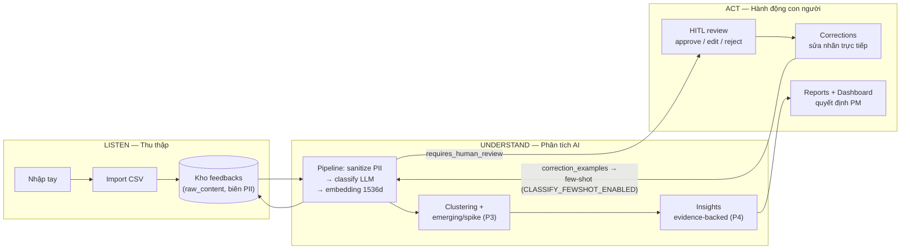

# Sitemap chức năng theo khung Voice of Customer (Listen – Understand – Act)

> **Mục đích:** bản đồ chức năng toàn hệ thống xếp theo khung VoC 3 trụ cột — dùng làm mốc tham chiếu để cải tiến UX/chức năng theo thời gian mà vẫn thấy mình đang cải tiến điểm nào của vòng lặp.
>
> **Nguồn bám (không phát minh endpoint/schema):** [`plans/UF-01-information-architecture.md`](plans/UF-01-information-architecture.md) (IA + trạng thái UI) · [`api-checklist.md`](api-checklist.md) (16 endpoint thật, snapshot 2026-08-25) · [`plans/delivery-contracts.md`](plans/delivery-contracts.md) C1–C6 · [`user-flows.md`](user-flows.md) F1–F7.
>
> **Ký hiệu trạng thái:** ✅ production · 🔶 đã có hook/API client nhưng chưa gắn UI · 🚧 stub 501 · ⬜ kế hoạch (đã có plan) · 💡 ý tưởng backlog (chưa có contract).
> **Ngày lập:** 2026-08-25 · sau khi Phase 13 (HITL backend) đóng.

---

## 1 · Vòng lặp VoC của hệ thống

Điểm bán hàng cốt lõi của luận văn nằm ở mũi tên khép vòng: **mỗi lần con người sửa nhãn là một lần AI được nuôi lại** (`correction_examples` → few-shot classification). Khi cải tiến UX, ưu tiên mọi thay đổi làm vòng này mượt hơn (review nhanh, sửa nhãn ít cấn).

---

## 2 · Sitemap theo 3 trụ cột

Sidebar hiện tại 6 mục theo thứ tự: Tổng quan · Phản hồi · Analysis · Clusters · Insights · Báo cáo — cả 2 role (`pm`, `operations`) dùng chung toàn bộ (v1 khai báo KHÔNG scale theo role, xem UF-01 §2).

### 2.1 🎧 LISTEN — Thu thập & lưu trữ tiếng nói khách hàng

*Mọi đường đưa giọng nói của khách vào hệ thống + kho tra cứu.*

| Điểm chạm | Chức năng | API | Trạng thái |
|---|---|---|---|
| `/feedbacks` — dialog Nhập liệu (tab nhập tay) | Thu 1 feedback đơn lẻ | `POST /api/feedbacks` | ✅ FE ✅ |
| `/feedbacks` — dialog Nhập liệu (tab CSV) | Import hàng loạt, báo lỗi theo dòng không abort file | `POST /api/feedbacks/import-csv` | ✅ FE ✅ |
| Gọi API trực tiếp (script/CLI ngoài UI) | Nuôi feed từ kênh khác về sau | cùng `POST /api/feedbacks` | ✅ |
| `/feedbacks` — list + filter URL params (`review_status`, `severity`, `category`, `offset`, `limit`) | Kho tra cứu, share link giữ nguyên trạng thái | `GET /api/feedbacks` | ✅ FE ✅ |
| `/feedbacks/[id]` — chi tiết | Nội dung sanitized; `raw_content` CHỈ trả khi `?include_raw=true`; badge PII | `GET /api/feedbacks/{id}` | 🔶 hook sẵn, trang đang build |
| `/feedbacks/[id]` — panel Similar | Tìm giọng nói tương tự (cosine quanh embedding) | `GET /api/feedbacks/{id}/similar` | 🔶 hook sẵn, panel đang build |

**Bản chất dữ liệu:** bảng `feedbacks` giữ `raw_content` (biên PII — presidio sanitize chạy ở pipeline, raw không bao giờ ra response mặc định/log/docs).

### 2.2 🧠 UNDERSTAND — AI biến giọng nói thô thành hiểu biết có cấu trúc

*Phân loại, ngữ nghĩa hóa, nhóm chủ đề, rút ra insight — kèm cờ điểm nào cần con người.*

| Điểm chạm | Chức năng | API | Trạng thái |
|---|---|---|---|
| `/analysis` — trigger run + progress polling + bảng kết quả | Batch classify: sentiment, severity, category, ai_issue, PII detected; row dính PII ⇒ `requires_human_review` ⇒ `review_status='pending'` | `POST /api/analysis/runs` · `GET /api/analysis/runs/{run_id}` · `GET .../results` | ✅ BE · ⬜ FE (FE-04) |
| Panel Similar (xem LISTEN) | Hiểu ngữ nghĩa: feedback nào nói cùng chuyện | embedding 1536d pgvector | ✅ |
| `/clusters` | Nhóm chủ đề tự nhiên (HDBSCAN trên embedding) + đặt tên cụm bằng LLM + cờ emerging/spike | `GET /api/clusters` (+ `POST /api/clusters/run` mới) | 🚧 stub · ⬜ P3 (plan 14) |
| `/insights` | Insight theo cụm ưu tiên, title/summary/suggested_action + `evidence_ids` thật (snippet chỉ từ sanitized) | `GET /api/insights` (+ `POST /api/insights/run` mới, cap env chống đốt credit) | 🚧 stub · ⬜ P4 (plan 15) |

**Ghi chú chức năng:** pipeline idempotent-resume (run fail chạy lại không nhân bản); similar trả 409 kèm hướng dẫn khi feedback chưa embed — UI bắt buộc dịch 409 thành CTA "chạy analysis trước".

### 2.3 🎬 ACT — Con người ra quyết định & nuôi lại AI

*Nơi giá trị VoC thực sự xảy ra: duyệt/sửa/từ chối, báo cáo, và vòng lặp cải thiện AI.*

| Điểm chạm | Chức năng | API | Trạng thái |
|---|---|---|---|
| Hàng chờ review = filter `review_status=pending` tại `/feedbacks` (+ UI riêng FE-05: dialog edit / AlertDialog reject) | HITL duyệt/sửa/từ chối qua LangGraph interrupt/resume + Postgres checkpoint — crash giữa đường thì retry TỰ-HEAL, người dùng chỉ cần bấm lại | `POST /api/reviews/{feedback_id}` | ✅ BE (P2 xong 2026-08-25) · ⬜ FE (FE-05) |
| Sửa nhãn tại detail | Sửa categories/ai_issue/severity/sentiment bất kể review_status; ghi `correction_examples` nuôi few-shot | `POST /api/corrections/{feedback_id}` | ✅ BE · ⬜ FE |
| `/dashboard` | Tổng quan điều hành PM: totals, pending review, emerging… (C4 render dạng chart) | `GET /api/reports/summary` | 🚧 stub · ⬜ P4 (plan 16 + FE-06) |
| `/reports` | Báo cáo tổng hợp `?days=7\|30\|90`: totals, by_severity, by_sentiment, top_categories, emerging — thuần SQL, không tốn LLM | cùng endpoint trên | 🚧 stub · ⬜ P4 |

**Contract đáng nhớ cho UX:** `approve` KHÔNG sinh dòng log nào; chỉ `edit`/`reject` ghi `human_reviews` + `correction_examples`. POST lần 2 lên thread completed → 409 — UI nên coi 409 review là "đã xử lý rồi", refresh row thay vì báo lỗi đỏ.

### 2.4 ⚙️ Nền tảng dùng chung (cross-cutting)

| Thành phần | Chi tiết | Trạng thái |
|---|---|---|
| `/login` | JWT cookie httpOnly SameSite=Lax; guard middleware toàn khu `(app)`; 401 giữa phiên → redirect login | ✅ |
| RBAC | Đúng 2 role `pm` \| `operations`, guard tầng router, UI không ẩn/hiện theo role (v1) | ✅ |
| Đăng ký + Google OAuth + logout | Email/mật khẩu (role mặc định operations) + Google (email lạ tự tạo user) | ⬜ P1.5 (FE-08, backlog) |
| Health | `GET /api/health`: DB, structured_output_mode, models, pii_mode | ✅ (debug/deploy) |
| Bộ lỗi chuẩn | 401/403/404/409/422/500 — inventory xử lý thống nhất ở UF-01 §5 | ✅ quy ước |
| Root `/` | Đích thiết kế redirect `/dashboard` — hiện còn placeholder template | 💡 OQ-3 (việc FE nhỏ) |

---

## 3 · Lộ trình còn lại (mỗi mục rơi vào trụ cột nào)

| Pha | Nội dung | Trụ cột | Điều kiện |
|---|---|---|---|
| P1 (tiếp) | FE-04 màn Analysis nối 3 endpoint runs | Understand | FE-03 ✅ |
| P1.5 | Register + Google OAuth + logout (FE-08) | Nền tảng | GCP credentials owner |
| P2 (tiếp) | FE-05 hàng chờ review + dialog edit/reject | Act | UF-04 ✅, plan 13 BE ✅ |
| P3 | Plan 14 BE clusters + phần clusters FE-06 | Understand | UF-05 (phần clusters) |
| P4 | Plan 15 insights · plan 16 reports + dashboard chart | Understand + Act | UF-05 (phần còn lại) |
| P5 | Polish `[tuỳ chọn]` + data demo bảo vệ (FE-07) | tất cả | — |

Thứ tự cứng P0→P5 xem [`plans/delivery-execute-plan.md`](plans/delivery-execute-plan.md) §1 — file này KHÔNG đổi thứ tự, chỉ map chức năng.

---

## 4 · Backlog cải tiến UX & chức năng (theo thời gian)

> 💡 Toàn bộ mục này là Ý TƯỞNG — chưa có contract. Muốn làm mục nào: viết/ cập nhật contract + entry `decisions.md` TRƯỚC, sync [`api-checklist.md`](api-checklist.md) trong cùng commit nếu đụng endpoint (Hard rule #10). Tick dần theo từng phiên cải tiến.

### LISTEN
- [ ] Quick-filter chips trên list: "Pending review (n)", "PII", "Critical" — 1 click thay vì mở dropdown
- [ ] Ô tìm kiếm nội dung (full-text trên sanitized; semantic search tái dùng embedding — nền đã có từ phase 08)
- [ ] Xuất CSV list theo filter hiện tại (ngược lại với import)
- [ ] Saved filters / bookmark URL filter (URL params đã hỗ trợ sẵn — chỉ thiếu UI lưu)
- [ ] Gộp trùng lặp: từ panel Similar đề xuất "các feedback nói cùng chuyện" → action merge/archive
- [ ] Kênh thu thập mới (form public, webhook email…) — mỗi kênh = 1 contract mới, cân nhắc scope luận văn

### UNDERSTAND
- [ ] Tiến độ run realtime (polling → SSE/WebSocket) + toast "run xong"
- [ ] Trang kết quả run: so sánh trước/sau khi few-shot bật (chứng minh vòng lặp cải thiện — tư liệu bảo vệ rất mạnh)
- [ ] Drill-down cluster → danh sách feedback thành viên (sample_feedback_ids ≤5 đã trả, cần view đầy đủ)
- [ ] Biểu đồ trend theo thời gian cho cụm emerging/spike (dữ liệu current/previous count đã có)
- [ ] Điều chỉnh ngưỡng/param clustering từ UI (hiện env-only)

### ACT
- [ ] Bulk review: chọn nhiều pending → approve/reject hàng loạt (graph hiện 1 feedback/request — cần contract batch)
- [ ] Badge số lượng pending trên sidebar item "Phản hồi" (poll nhẹ hoặc tính khi load list)
- [ ] Lịch sử review hiển thị tại detail (ai duyệt, khi nào, action gì — dữ liệu `human_reviews` đã có, chỉ thiếu view)
- [ ] Đánh giá hữu ích cho từng insight (👍/👎 → tín hiệu nuôi vòng lặp cấp insight)
- [ ] SLA/aging: pending quá X ngày tô cảnh báo trên hàng chờ
- [ ] Xuất báo cáo PDF/ảnh chart cho buổi bảo vệ/họp
- [ ] Thông báo (in-app) khi có pending mới sau run

### NỀN TẢNG
- [ ] Logout + đăng ký + Google OAuth (đã có plan FE-08 — kéo lên sớm nếu demo cần nhiều vai)
- [ ] Dark mode toggle (FE-07 `[tuỳ chọn]`)
- [ ] Phân quyền sâu hơn pm vs operations (hiện KHÔNG scale v1 — muốn làm phải qua decisions.md đổi scope)

---

## 5 · Quy tắc khi cải tiến (để bản đồ không mục nát)

1. **Không phát minh endpoint trong UI** — mọi field trỏ contract C-mục; endpoint mới phải đi qua contract + sync `api-checklist.md` trong cùng commit.
2. **PII boundary bất di bất dịch** — `raw_content` không ra khỏi biên sanitize; mọi tính năng mới (export, log, thông báo) tự kiểm tra luật này đầu tiên.
3. **Trạng thái dùng chung** — loading/error/empty/badge theo đúng inventory UF-01 §5, không chế variant riêng từng màn.
4. **Lệch kế hoạch → `decisions.md` trước khi code.**
5. Sau mỗi đợt cải tiến: cập nhật lại cột Trạng thái ở §2 của chính file này — nó là ảnh chụp hiện trạng, để lâu sẽ sai.
